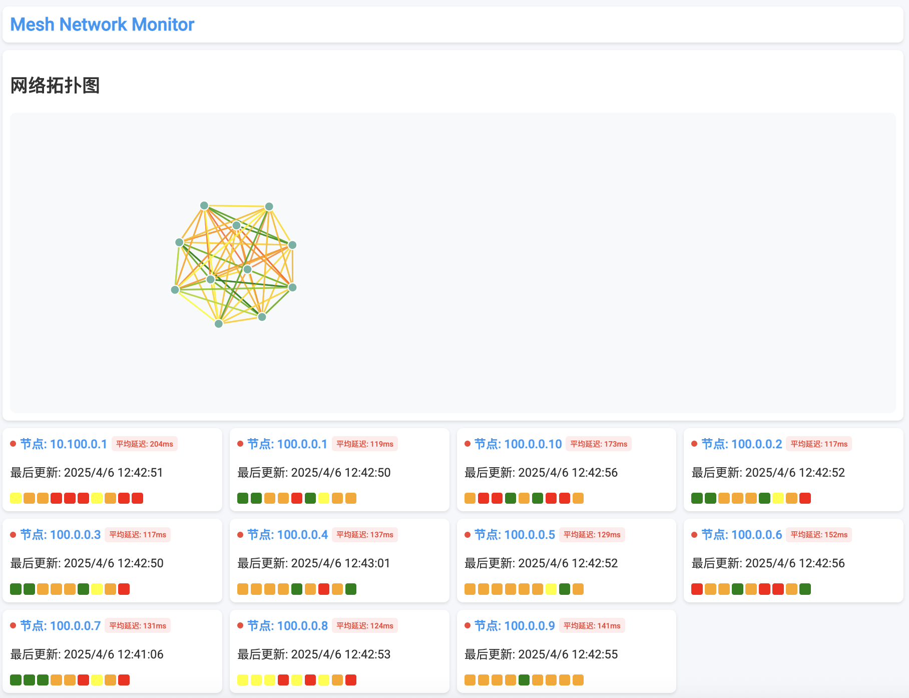

# Mesh Network Monitor



Demo: [https://mesh.tms.im](https://mesh.tms.im)

This project provides a simple mesh network monitoring solution, consisting of a server and client application. The client collects network status information (latency, packet loss, connection status) and sends it to the server. The server aggregates this data and provides a web interface for visualization.

## Features

*   **Node Status Collection:** Clients collect real-time connection status, latency, and packet loss data.
*   **Centralized Data Aggregation:** The server aggregates the data from all clients.
*   **Web-based Visualization:** A web interface provides a visual representation of the network topology and node status.
*   **Historical Data Storage:** The server stores historical data for analysis.
*   **Data Purging:** Automatically removes old data to maintain a reasonable database size.
*   **Network Topology Graph:** Visual representation of the network using D3.js.
*   **Node Grid:** A grid displaying detailed information for each node, including connection status and latency.
*   **Color-coded Latency Indicators:** Visual cues for quick identification of network performance issues.

## Architecture

The project comprises the following components:

*   **Server (mesh-monitor/server):**
    *   Written in Go.
    *   Receives status updates from clients via HTTP POST requests.
    *   Stores node statuses and historical data.
    *   Provides API endpoints for retrieving node statuses and historical data.
    *   Serves the web interface.

*   **Client (mesh-monitor/client):**
    *   Written in Go.
    *   Collects network status information by pinging other nodes.
    *   Sends the collected data to the server via HTTP POST requests.
    *   Requires environment variables `NODE_IP` and `SERVER_URL`.

*   **Web Interface (mesh-monitor/server/web):**
    *   HTML, CSS, and JavaScript.
    *   Fetches node status data from the server.
    *   Visualizes the network topology and node status using D3.js.

*   **Ansible (mesh-monitor/ansible):**
    *   Provides automation for deploying the client application to multiple nodes.

## Requirements

*   **Go:** Version 1.24.2 or later.
*   **Ansible:** (Optional, for automated client deployment)
*   **A network of machines with connectivity to each other.**
*   **Network nodes should have the `ping` utility installed.**

## Installation and Usage

### 1. Build the Go Applications

```bash
cd mesh-monitor/server
go build -o mesh-monitor-server main.go
cd ../client
go build -o mesh-monitor-client main.go
```

### 2. Run the Server

```bash
cd mesh-monitor/server
./mesh-monitor-server
```

The server will start on port `23480`.  You can access the web interface at `http://<server_ip>:23480`.

### 3. Deploy and Configure the Clients

You can deploy the client manually or using Ansible.

**Manual Deployment:**

1.  Copy the `mesh-monitor-client` executable to each node in your network.
2.  Set the following environment variables on each node:
    *   `NODE_IP`: The IP address of the node.
    *   `SERVER_URL`: The URL of the server (e.g., `http://10.0.0.1:23480`).
3.  Run the client on each node:

```bash
./mesh-monitor-client
```

**Ansible Deployment:**

1.  Modify the `server_url` variable in `mesh-monitor/ansible/deploy.yml` to point to your server's address.
2.  Configure your Ansible inventory to include all the nodes in your network. The `inventory_hostname` variable will be used as `NODE_IP`.
3.  Run the Ansible playbook:

```bash
cd mesh-monitor/ansible
ansible-playbook deploy.yml
```

### 4. Access the Web Interface

Open a web browser and navigate to `http://<server_ip>:23480` to view the network monitoring dashboard.

## Configuration

*   **Server:**  The server listens on port `23480` by default.  This can be changed in `main.go`.  Historical data is retained for 24 hours and automatically purged.

*   **Client:**
    *   `NODE_IP`: Must be set to the IP address of the node.
    *   `SERVER_URL`: Must be set to the URL of the server.
    *   The client pings IPs in the range of `10.0.0.1` to `10.0.0.10`, excluding its own IP. This range can be modified in `client/main.go`. The ping count is hardcoded as 4.

## Future Enhancements

*   Implement more advanced network diagnostics (e.g., traceroute).
*   Improve the web interface with more detailed statistics and visualizations.
*   Support dynamic node discovery.
*   Add alerting capabilities.

## Contributing

Contributions are welcome! Please submit pull requests with bug fixes, new features, or improvements to the documentation.
